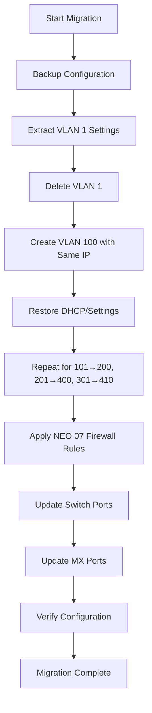

# Complete VLAN Migration Guide with NEO 07 Standards

**Purpose:** Migrate legacy VLAN numbering to corporate standard while applying NEO 07 firewall rules  
**Last Updated:** July 10, 2025

## Quick Overview

This guide covers migrating networks from legacy VLAN numbering (1, 101, 201, 301) to the new corporate standard (100, 200, 400, 410) while preserving all network functionality and applying standardized NEO 07 firewall rules.

## Why This Migration?

1. **Standardization**: All stores should use consistent VLAN numbering
2. **NEO 07 Template**: NEO 07 has the standard firewall ruleset for all stores
3. **IP Preservation**: Keep existing IP ranges to avoid reconfiguration of devices
4. **Zero Downtime**: Migration process ensures continuous operation

## Complete Migration Process

### Pre-Migration Checklist

- [ ] Backup current network configuration
- [ ] Document current VLAN usage and IP ranges
- [ ] Verify API access and permissions
- [ ] Schedule maintenance window (15-20 minutes)
- [ ] Test on TST 01 network first

### Step 1: Prepare Firewall Template

Extract and prepare NEO 07 firewall rules with updated VLAN references:

```bash
# Extract NEO 07 rules and create template
python3 prepare_neo07_firewall_template.py

# This creates:
# - neo07_firewall_template_original.json (original rules)
# - neo07_firewall_template_20250710.json (updated VLAN references)
# - neo07_firewall_template_documentation.md
```

### Step 2: Run VLAN Migration

Execute the migration script which will:
1. Backup all configurations
2. Migrate VLANs one by one (delete old → create new)
3. Update firewall rules
4. Update all port configurations

```bash
# Dry run first (recommended)
python3 vlan_number_migration.py --network-id L_XXXXXXXXX --dry-run

# Review dry run output, then execute
python3 vlan_number_migration.py --network-id L_XXXXXXXXX
```

### Step 3: Verify Migration

Check that all components were updated correctly:

```bash
# Use the verification script
python3 verify_vlan_migration.py --network-id L_XXXXXXXXX

# Manual checks:
# - All VLANs show new IDs
# - Firewall rules reference new VLANs
# - Switch/MX ports on correct VLANs
# - DHCP working on all VLANs
```

## Detailed Process Flow



## What Changes vs What Stays the Same

### Changes ✓
- VLAN IDs (1→100, 101→200, 201→400, 301→410)
- Firewall rule VLAN references
- Switch port VLAN assignments
- MX port VLAN assignments

### Stays the Same ✓
- IP subnets (no changes)
- DHCP settings and reservations
- DNS servers
- DHCP options (VoIP settings)
- Group policy assignments
- Device configurations

## VLAN Mapping Reference

| Function | Old VLAN | New VLAN | Typical Subnet |
|----------|----------|----------|----------------|
| Data/Workstations | 1 | 100 | 10.x.x.0/25 |
| Voice/VoIP | 101 | 200 | 10.x.x.128/27 |
| Credit Card/POS | 201 | 400 | 10.x.x.160/28 |
| Scanners | 301 | 410 | 10.x.x.192/28 |
| AP Management | 300 | 300 | 10.x.x.176/28 |
| Guest | 800 | 800 | 172.x.0.0/24 |
| IoT | 801-803 | 801-803 | 172.x.0.0/24 |

## Migration Script Details

### vlan_number_migration.py

Main migration script that handles:
- Configuration backup
- VLAN deletion and recreation
- Settings preservation
- Port updates
- Firewall rule updates

Key features:
- Dry run mode for testing
- Automatic backup creation
- Detailed logging
- Rollback information

### prepare_neo07_firewall_template.py

Prepares standardized firewall rules:
- Extracts from NEO 07
- Updates VLAN references
- Creates ready-to-apply template

## Common Issues and Solutions

### Issue 1: VLAN Already Exists
**Error:** "VLAN 100 already exists"  
**Solution:** Delete default VLAN 100 before migration

### Issue 2: IP Conflict
**Error:** "IP subnet already in use"  
**Solution:** Ensure old VLAN is fully deleted before creating new one

### Issue 3: Port Update Fails
**Error:** "Invalid VLAN" on port update  
**Solution:** Verify new VLAN exists before updating ports

### Issue 4: DHCP Not Working
**Issue:** Devices not getting IP addresses  
**Solution:** Check DHCP settings were preserved, verify DHCP mode

## Testing on TST 01

Before running on production:

1. Apply configuration to TST 01:
```bash
# Clean TST 01
python3 clean_network.py --network-id L_3790904986339115852

# Run migration
python3 vlan_number_migration.py --network-id L_3790904986339115852
```

2. Test all functionality:
- Inter-VLAN routing
- DHCP on all VLANs
- Firewall rules
- Port connectivity

## Post-Migration Validation

### Automated Checks
```bash
python3 post_migration_validate.py --network-id L_XXXXXXXXX
```

### Manual Validation
1. **VLANs**: Verify all show new IDs in dashboard
2. **DHCP**: Test device on each VLAN gets IP
3. **Routing**: Ping between VLANs per firewall rules
4. **Voice**: VoIP phones register and get DHCP options
5. **Credit Card**: POS terminals connect properly
6. **Wireless**: APs on correct management VLAN

## Rollback Procedure

If issues occur:

1. Locate backup file:
```bash
ls -la vlan_migration_backup_*.json
```

2. Run rollback script:
```bash
python3 vlan_migration_rollback.py --backup-file <backup.json>
```

3. Or manually restore using backup data

## Script Execution Order

For complete migration:

```bash
# 1. Prepare firewall template
python3 prepare_neo07_firewall_template.py

# 2. Run migration (dry run)
python3 vlan_number_migration.py --network-id L_XXX --dry-run

# 3. Review and run actual migration
python3 vlan_number_migration.py --network-id L_XXX

# 4. Verify
python3 verify_vlan_migration.py --network-id L_XXX
```

## Support Files Generated

1. **Backup Files**:
   - `vlan_migration_backup_<network>_<timestamp>.json`
   - Complete configuration backup

2. **Report Files**:
   - `vlan_migration_report_<network>_<timestamp>.txt`
   - Detailed migration log

3. **Firewall Templates**:
   - `neo07_firewall_template_original.json`
   - `neo07_firewall_template_<date>.json`

## Best Practices

1. **Always test on TST 01 first**
2. **Run dry-run before actual migration**
3. **Keep backup files for 30 days**
4. **Document any site-specific changes**
5. **Verify each step completes before proceeding**

---

**Migration Time:** ~15-20 minutes  
**Downtime:** Near zero (seconds per VLAN)  
**Risk Level:** Low with proper testing