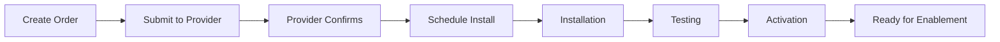

# DSR Circuits - Circuit Orders Documentation

## Overview
**URL**: `/circuit-orders`  
**File**: `/usr/local/bin/Main/status.py`  
**Blueprint**: `status_bp`  
**Purpose**: Order management, procurement tracking, and circuit provisioning workflow

## Page Layout & Components

### Header Section
- **Title**: "Circuit Order Management"
- **Subtitle**: "Track circuit orders from request to activation"
- **Status Summary**: Active orders count and pending approvals

### Navigation Controls
- **🏠 Home Button**: Returns to main navigation (`/home`)
- **Create Order Button**: New circuit order form
- **Filter Controls**: Status, date, provider filters
- **Search Bar**: Find orders by ID, site, or provider

## Order Management Interface

### Order Status Board
**Purpose**: Kanban-style view of orders by status

#### Status Columns
1. **📝 Draft**:
   - Orders being prepared
   - Not yet submitted
   - Editable state

2. **✅ Submitted**:
   - Sent to provider
   - Awaiting acknowledgment
   - Order locked

3. **🔄 In Progress**:
   - Provider working
   - Install scheduled
   - Updates available

4. **🚧 Installation**:
   - On-site work
   - Testing phase
   - Near completion

5. **✓ Completed**:
   - Circuit active
   - Ready for enablement
   - Billing started

6. **❌ Cancelled**:
   - Order cancelled
   - Reason documented
   - No billing

#### Drag & Drop Features
- **Status Updates**: Drag cards between columns
- **Visual Feedback**: Drop zones highlight
- **Validation**: Prevents invalid transitions
- **Audit Trail**: All moves logged

### Order Details Panel
**Purpose**: Comprehensive order information

#### Information Sections
1. **Order Header**:
   - Order ID (auto-generated)
   - Site Name & ID
   - Creation Date
   - Current Status

2. **Circuit Details**:
   - Circuit Type (Primary/Backup/Guest)
   - Provider Selection
   - Speed Requirements
   - Special Requirements

3. **Timeline**:
   - Order Created
   - Provider Notified
   - Install Scheduled
   - Work Completed
   - Circuit Activated

4. **Documentation**:
   - Order Forms (PDF)
   - Provider Quotes
   - Install Photos
   - Test Results

## Create New Order

### Order Form Fields
```javascript
// Required fields
{
    site_name: "TXH 97",
    site_id: "TXH97",
    circuit_purpose: "Primary|Backup|Guest",
    provider: "AT&T|Comcast|Spectrum|etc",
    speed: "100M|500M|1G|etc",
    requested_by: "User Name",
    justification: "Business reason"
}

// Optional fields
{
    target_date: "2025-08-01",
    monthly_cost: 500.00,
    install_cost: 1000.00,
    contract_term: "36 months",
    notes: "Special instructions"
}
```

### Validation Rules
- **Duplicate Check**: Prevent multiple orders same site/type
- **Budget Validation**: Check against allocated budget
- **Provider Availability**: Verify serviceability
- **Approval Required**: Orders over $X need approval

## Order Workflow

### Automated Workflows


### Email Notifications
- **Order Created**: Notify requestor and approvers
- **Provider Update**: Status changes from provider
- **Install Scheduled**: Date/time confirmation
- **Completion**: Circuit ready notification

### Integration Points
1. **Provider APIs**:
   - Automated order submission
   - Status polling
   - Document retrieval

2. **ServiceNow**:
   - Create SCTASK
   - Update on milestones
   - Close on completion

3. **Finance System**:
   - Budget validation
   - Cost tracking
   - Invoice matching

## Bulk Operations

### Bulk Order Creation
**Purpose**: Order multiple circuits simultaneously

#### Features
- **Excel Import**: Upload order spreadsheet
- **Template Download**: Pre-formatted Excel
- **Validation Report**: Check before submit
- **Batch Processing**: Submit all at once

### Bulk Status Updates
- **Select Multiple**: Checkbox selection
- **Bulk Actions**: Update status, assign, cancel
- **Confirmation**: Review before apply
- **Rollback**: Undo bulk changes

## Reporting & Analytics

### Order Metrics Dashboard
- **Orders by Status**: Current distribution
- **Provider Performance**: On-time delivery %
- **Cost Analysis**: Budget vs actual
- **Lead Time Trends**: Order to activation days

### Available Reports
1. **Open Orders Report**:
   - All non-completed orders
   - Aging analysis
   - Bottleneck identification

2. **Provider Report Card**:
   - On-time delivery
   - Quality metrics
   - Cost comparison

3. **Budget Report**:
   - Committed spend
   - Actual spend
   - Variance analysis

## Search & Filter

### Quick Filters
- **Status**: Draft, Submitted, In Progress, etc.
- **Provider**: AT&T, Comcast, Spectrum, etc.
- **Date Range**: Created, Updated, Completed
- **Cost Range**: Under $500, $500-1000, Over $1000

### Advanced Search
```sql
-- Example search queries
site_name:"TXH*" AND status:"In Progress"
provider:"AT&T" AND created_date:">2025-01-01"
monthly_cost:">500" AND circuit_purpose:"Primary"
```

## API Endpoints

### Order Management APIs
- `GET /api/orders` - List orders with filters
- `POST /api/orders` - Create new order
- `PUT /api/orders/{id}` - Update order
- `DELETE /api/orders/{id}` - Cancel order

### Bulk Operations
- `POST /api/orders/bulk` - Create multiple
- `PUT /api/orders/bulk-status` - Update multiple
- `POST /api/orders/import` - Excel import

### Reporting APIs
- `GET /api/orders/metrics` - Dashboard data
- `GET /api/orders/report/{type}` - Generate reports
- `GET /api/orders/export` - Export to Excel/CSV

## Mobile Features

### Mobile-Optimized Views
- **Card View**: Touch-friendly order cards
- **Swipe Actions**: Quick status updates
- **Photo Upload**: Install photos from mobile
- **Signature Capture**: Digital sign-offs

### Offline Capability
- **Local Storage**: Work without connection
- **Queue Updates**: Sync when online
- **Conflict Resolution**: Handle concurrent edits

## Integration Documentation

### Provider Integration
```python
# Provider API example
def submit_order_to_provider(order):
    provider_api = get_provider_api(order.provider)
    response = provider_api.create_order({
        'customer_id': 'DISCOUNT_TIRE',
        'site_address': order.site_address,
        'service_type': order.circuit_purpose,
        'bandwidth': order.speed,
        'term': order.contract_term
    })
    return response.order_id
```

### ServiceNow Integration
- **Trigger**: Order reaches "Submitted" status
- **SCTASK Fields**: Mapped from order data
- **Updates**: Bi-directional sync
- **Completion**: Auto-close on activation

## Data Model

### Orders Table
```sql
CREATE TABLE circuit_orders (
    id SERIAL PRIMARY KEY,
    order_number VARCHAR(50) UNIQUE,
    site_name VARCHAR(100),
    site_id VARCHAR(50),
    circuit_purpose VARCHAR(50),
    provider VARCHAR(100),
    speed VARCHAR(50),
    status VARCHAR(50),
    created_date TIMESTAMP,
    updated_date TIMESTAMP,
    completed_date TIMESTAMP,
    monthly_cost DECIMAL(10,2),
    install_cost DECIMAL(10,2),
    created_by VARCHAR(100),
    assigned_to VARCHAR(100),
    notes TEXT
);
```

## Security & Permissions

### Role-Based Access
- **Viewer**: Read-only access
- **Requester**: Create/edit own orders
- **Approver**: Approve high-value orders
- **Admin**: Full access, bulk operations

### Audit Trail
- **All Changes Logged**: Who, what, when
- **Immutable History**: Cannot delete logs
- **Compliance Ready**: SOX compliant
- **Regular Audits**: Monthly review

---
*Last Updated: July 3, 2025*  
*Complete circuit order lifecycle management*  
*Part of DSR Circuits Documentation Suite*