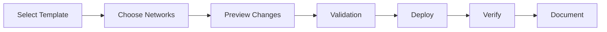

# DSR Circuits - Firewall Management Documentation

## Overview
**URL**: `/firewall`  
**File**: `/usr/local/bin/Main/dsrcircuits.py`  
**Purpose**: Security rule administration, template management, and firewall policy deployment

## Page Layout & Components

### Header Section
- **Title**: "Meraki MX Firewall Rules Editor"
- **Subtitle**: "Centralized firewall policy management"
- **Environment Indicator**: Production/Test/Dev
- **Last Sync**: Shows last rule synchronization

### Navigation & Controls
- **🏠 Home Button**: Returns to main navigation (`/home`)
- **Template Manager**: Access rule templates
- **Network Selector**: Choose target networks
- **Deploy Button**: Push changes to firewalls
- **Backup Button**: Save current configurations

## Main Interface Areas

### Rule Template Manager
**Purpose**: Standardized firewall rule templates

#### Template Categories
1. **🏢 Standard Store Template**:
   - POS system rules
   - Guest WiFi isolation
   - Management access
   - Default deny rules

2. **🏗️ Construction Template**:
   - Temporary vendor access
   - Limited internet access
   - Time-based rules
   - Logging enabled

3. **🏭 Distribution Center**:
   - WMS integration rules
   - EDI communications
   - VPN access rules
   - High-throughput optimized

4. **🔧 Custom Templates**:
   - User-created templates
   - Special requirements
   - Hybrid configurations
   - Test templates

### Rule Editor Grid
**Purpose**: Visual rule creation and editing

#### Rule Components
| # | Policy | Protocol | Src Port | Src CIDR | Dest Port | Dest CIDR | Action | Comment |
|---|---------|----------|----------|----------|-----------|-----------|---------|----------|
| 1 | Allow | TCP | Any | 10.1.1.0/24 | 443 | Any | Allow | POS to Cloud |
| 2 | Deny | Any | Any | 192.168.1.0/24 | Any | 10.0.0.0/8 | Deny | Guest isolation |
| 3 | Allow | TCP | Any | 10.2.0.0/16 | 22 | 10.1.1.0/24 | Allow | Management SSH |

#### Interactive Features
- **Drag to Reorder**: Change rule priority
- **Click to Edit**: In-line editing
- **Right-Click Menu**: Copy, disable, delete
- **Validation**: Real-time syntax checking

### Live Firewall View
**Purpose**: See actual rules on selected firewall

#### Display Options
- **Side-by-Side**: Template vs actual
- **Diff View**: Highlight differences
- **Merged View**: Combined ruleset
- **Raw View**: JSON/CLI format

## Rule Creation & Editing

### Rule Builder Form
```javascript
{
    comment: "Descriptive rule purpose",
    policy: "allow|deny",
    protocol: "any|tcp|udp|icmp",
    srcPort: "any|80|443|range:1024-65535",
    srcCidr: "any|10.0.0.0/8|specific-ip",
    destPort: "any|80|443|range",
    destCidr: "any|10.0.0.0/8|specific-ip",
    syslogEnabled: true|false
}
```

### Common Rule Patterns

#### POS Communication
```javascript
// POS to payment processor
{
    comment: "POS to payment gateway",
    policy: "allow",
    protocol: "tcp",
    srcCidr: "10.1.1.0/24", // POS VLAN
    destPort: "443",
    destCidr: "payment.processor.com"
}
```

#### Guest WiFi Isolation
```javascript
// Block guest to corporate
{
    comment: "Guest WiFi isolation",
    policy: "deny",
    protocol: "any",
    srcCidr: "192.168.1.0/24", // Guest VLAN
    destCidr: "10.0.0.0/8" // Corporate
}
```

### Rule Validation
- **Syntax Check**: Valid CIDR notation
- **Conflict Detection**: Overlapping rules
- **Security Audit**: Overly permissive rules
- **Best Practices**: Rule optimization

## Deployment Management

### Deployment Workflow


### Network Selection
**Multi-Select Interface**: Deploy to multiple sites

#### Selection Methods
1. **Individual**: Click each network
2. **Region**: Select by geography
3. **Type**: All stores, all DCs
4. **Custom Group**: Saved selections

### Deployment Options
```javascript
deploymentConfig = {
    mode: "immediate|scheduled|staged",
    backup: true|false,
    rollback: "auto|manual",
    notification: "email|sms|dashboard",
    validation: "strict|warning|none"
};
```

### Rollback Capability
- **Automatic Backup**: Before any changes
- **One-Click Rollback**: Restore previous
- **Staged Rollback**: Selective undo
- **Audit Trail**: All changes logged

## Template Management

### Creating Templates
1. **Start from Existing**: Clone and modify
2. **Build from Scratch**: Empty template
3. **Import from Network**: Copy live rules
4. **Upload JSON/CSV**: Bulk import

### Template Versioning
```
Standard_Store_Template_v3.2
├── Created: 2025-01-15
├── Modified: 2025-07-03
├── Author: John Doe
├── Changes: Added IoT device rules
└── Previous: v3.1 (archived)
```

### Template Variables
```javascript
// Dynamic template values
{
    {{STORE_SUBNET}}: "10.X.X.0/24",
    {{MGMT_IP}}: "10.0.0.X",
    {{REGION_DNS}}: "dns.region.local",
    {{DEPLOYMENT_DATE}}: "2025-07-03"
}
```

## Compliance & Auditing

### Compliance Checks
**Automated Rule Auditing**: PCI-DSS, SOX compliance

#### Compliance Rules
- ✅ Default deny rule exists
- ✅ No "any-any" allow rules  
- ✅ Management ports restricted
- ✅ Logging enabled critical rules
- ⚠️ Warning: Permissive rules detected

### Audit Reports
1. **Rule Change Report**:
   - Who changed what when
   - Before/after comparison
   - Business justification
   - Approval trail

2. **Compliance Report**:
   - Current compliance status
   - Non-compliant rules
   - Remediation needed
   - Historical trending

3. **Security Report**:
   - Open ports summary
   - Risk assessment
   - Recommendations
   - Vulnerability mapping

## Search & Analysis

### Rule Search
```sql
-- Search syntax examples
comment:"POS" AND action:"allow"
destPort:"443" AND srcCidr:"10.*"
protocol:"tcp" AND destPort:"22"
policy:"deny" AND srcCidr:"0.0.0.0/0"
```

### Rule Analytics
- **Most Used Ports**: Traffic analysis
- **Rule Hits**: Which rules trigger
- **Denied Traffic**: Security events
- **Rule Efficiency**: Optimization

## API Integration

### Meraki Dashboard API
```python
def deploy_firewall_rules(network_id, rules):
    """Deploy rules to network"""
    dashboard = meraki.DashboardAPI(api_key)
    
    # Validate rules
    validated_rules = validate_ruleset(rules)
    
    # Backup current
    current = dashboard.appliance.getNetworkApplianceFirewallL3FirewallRules(network_id)
    save_backup(network_id, current)
    
    # Deploy new rules
    response = dashboard.appliance.updateNetworkApplianceFirewallL3FirewallRules(
        network_id,
        rules=validated_rules
    )
    
    return response
```

### Bulk Operations
```python
def bulk_deploy_template(template_id, network_ids):
    """Deploy template to multiple networks"""
    template = load_template(template_id)
    results = []
    
    for network_id in network_ids:
        try:
            result = deploy_firewall_rules(network_id, template.rules)
            results.append({
                'network_id': network_id,
                'status': 'success',
                'rules_deployed': len(template.rules)
            })
        except Exception as e:
            results.append({
                'network_id': network_id,
                'status': 'failed',
                'error': str(e)
            })
    
    return results
```

## Scheduling & Automation

### Scheduled Deployments
- **Maintenance Windows**: Deploy during off-hours
- **Staged Rollouts**: Gradual deployment
- **Automated Testing**: Post-deployment validation
- **Rollback Windows**: Auto-revert timeframe

### Change Windows
```javascript
changeWindow = {
    start: "2025-07-03 22:00",
    end: "2025-07-04 02:00",
    networks: ["N_1234", "N_5678"],
    template: "Standard_Store_v3.2",
    approver: "manager@company.com",
    rollbackAfter: 3600 // seconds
};
```

## Monitoring & Alerts

### Real-Time Monitoring
- **Rule Hit Counts**: Live statistics
- **Blocked Traffic**: Security events
- **Performance Impact**: CPU/memory usage
- **Configuration Drift**: Unauthorized changes

### Alert Configuration
```javascript
alerts: {
    unauthorizedChange: true,
    highBlockRate: 1000, // blocks/min
    ruleError: true,
    complianceViolation: true,
    notification: {
        email: ["security@company.com"],
        sms: ["+1234567890"],
        dashboard: true
    }
}
```

## Documentation Features

### Change Documentation
- **Change Request**: Why the change
- **Impact Analysis**: What's affected
- **Test Results**: Validation outcome
- **Approval Chain**: Who approved

### Rule Documentation
```javascript
// Well-documented rule example
{
    comment: "POS-001: Allow POS terminals to payment processor",
    policy: "allow",
    protocol: "tcp",
    srcCidr: "10.1.1.0/24", // POS VLAN at all stores
    srcPort: "any",
    destCidr: "52.1.1.1/32", // payment.processor.com
    destPort: "443",
    syslogEnabled: true,
    // Extended docs
    _documentation: {
        purpose: "Required for credit card processing",
        requestor: "IT Security",
        approver: "CISO",
        date: "2025-01-15",
        review: "2025-07-15"
    }
}
```

## Best Practices

### Rule Organization
1. **Group by Function**: POS, Guest, Management
2. **Number Rules**: For easy reference
3. **Descriptive Comments**: Clear purpose
4. **Regular Review**: Quarterly audit

### Security Guidelines
1. **Least Privilege**: Minimum required access
2. **Default Deny**: Explicit allow only
3. **Source Restriction**: Specific sources
4. **Logging Critical**: Enable for sensitive

### Performance Tips
1. **Order Matters**: Most-hit rules first
2. **Consolidate Rules**: Combine where possible
3. **Avoid Overlaps**: Clear rule boundaries
4. **Regular Cleanup**: Remove unused rules

---
*Last Updated: July 3, 2025*  
*Comprehensive firewall policy management system*  
*Part of DSR Circuits Documentation Suite*