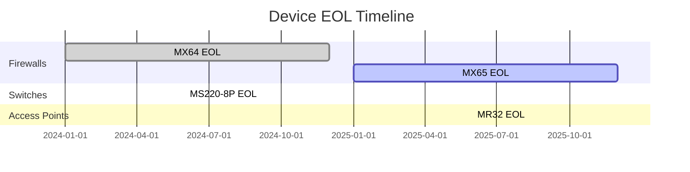

# DSR Circuits - Inventory Summary Documentation

## Overview
**URL**: `/inventory-summary`  
**File**: `/usr/local/bin/Main/inventory.py`  
**Blueprint**: `inventory_bp`  
**Purpose**: High-level network device management, EOL monitoring, and capacity planning

### Inventory Sources
- **Meraki Dashboard**: ~1,300+ cloud-managed devices
- **SNMP Collection**: 169 traditional network devices (Database verified July 7, 2025)
- **Combined View**: Unified inventory across all platforms (~1,469 total devices)

## Page Layout & Components

### Header Section
- **Title**: "Network Inventory Summary"
- **Subtitle**: "Device tracking and lifecycle management"
- **Last Sync**: Shows last Meraki API sync time
- **Total Devices**: Overall count across all types

### Control Panel
- **🏠 Home Button**: Returns to main navigation (`/home`)
- **Region Filter**: All Regions / Specific regions
- **Device Type Filter**: All Types / MX / MS / MR / MV
- **Refresh Button**: Force sync with Meraki API
- **Export Button**: Download inventory data

## Device Summary Cards

### Visual Device Cards
**Purpose**: At-a-glance view of device distribution

#### MX Firewalls Card
- **Icon**: 🔥 Firewall symbol
- **Total Count**: e.g., "847 devices"
- **Status Breakdown**:
  - ✅ Online: 825
  - ⚠️ Alerting: 15
  - ❌ Offline: 7
- **EOL Warning**: "23 devices approaching EOL"
- **Color**: Blue gradient (#3498db)

#### MS Switches Card
- **Icon**: 🔌 Switch symbol
- **Total Count**: e.g., "1,234 devices"
- **Port Utilization**: Average 67%
- **Status Breakdown**: Online/Alerting/Offline
- **EOL Warning**: Device EOL counts
- **Color**: Green gradient (#27ae60)

#### MR Access Points Card
- **Icon**: 📡 Wireless symbol
- **Total Count**: e.g., "2,567 devices"
- **Client Load**: Average clients per AP
- **Status Breakdown**: Online/Alerting/Offline
- **EOL Warning**: Aging device counts
- **Color**: Purple gradient (#9b59b6)

#### MV Cameras Card
- **Icon**: 📹 Camera symbol
- **Total Count**: e.g., "423 devices"
- **Recording Status**: Active recordings
- **Status Breakdown**: Online/Alerting/Offline
- **Storage Health**: Retention compliance
- **Color**: Orange gradient (#e67e22)

### Interactive Features
- **Click Card**: Drill down to device type details
- **Hover Effects**: Show additional metrics
- **Real-time Updates**: Live status changes
- **Progress Bars**: Visual capacity indicators

## Deployment Progress Section

### Overall Progress Bar
```javascript
// Progress calculation
const deployed = 4456;
const total = 5271;
const percentage = (deployed / total * 100).toFixed(1);
// Shows: "84.5% Deployed (4,456 of 5,271)"
```

### Deployment Metrics
- **Deployed**: Active in production
- **Staged**: Ready for deployment
- **In Transit**: Shipping to sites
- **On Order**: Procurement pipeline

## Model Distribution Table

### Table Structure
| Model | Type | Count | EOL Status | Avg Age | Action |
|-------|------|-------|------------|---------|---------|
| MX67  | Firewall | 245 | Current | 2.3 years | View |
| MX68W | Firewall | 125 | EOL 2026 | 3.1 years | Plan |
| MS120-8 | Switch | 456 | Current | 1.8 years | View |
| MR33 | AP | 892 | EOL 2025 | 4.2 years | ⚠️ Replace |

### Table Features
- **Sortable Columns**: Click headers to sort
- **EOL Highlighting**: Red for EOL, yellow for soon
- **Expandable Rows**: Show sites using model
- **Bulk Actions**: Select multiple for operations

## End-of-Life Management

### EOL Dashboard
**Purpose**: Proactive device lifecycle management

#### EOL Timeline


#### EOL Metrics
- **Devices at EOL**: Immediate attention needed
- **EOL within 6 months**: Planning required
- **EOL within 12 months**: Budget consideration
- **Replacement Cost**: Estimated budget impact

### Replacement Planning
- **Automated Recommendations**: Suggested replacements
- **Budget Calculator**: Cost per site/model
- **Migration Path**: Technical requirements
- **Project Timeline**: Phased approach

## Search & Filter Capabilities

### Quick Filters
- **By Status**: Online, Offline, Alerting
- **By EOL**: Current, Approaching, At EOL
- **By Age**: <1 year, 1-3 years, >3 years
- **By Region**: Geographic filtering

### Advanced Search
```sql
-- Search examples
model:"MX*" AND status:"online"
eol_date:"<2026-01-01" AND type:"switch"
age:">3" AND region:"Southwest"
serial:"Q2*" AND status:"alerting"
```

## Analytics & Insights

### Device Health Score
```javascript
// Health calculation
healthScore = (
    (onlinePercentage * 0.4) +
    (nonEOLPercentage * 0.3) +
    (utilizationScore * 0.2) +
    (ageScore * 0.1)
);
```

### Trend Analysis
- **Growth Rate**: Devices added per month
- **Failure Rate**: MTBF by model
- **Refresh Rate**: Replacement velocity
- **Cost Trends**: TCO analysis

### Predictive Analytics
- **Failure Prediction**: ML-based forecasting
- **Capacity Planning**: Growth projections
- **Budget Forecasting**: Future spend estimates
- **EOL Impact**: Operational risk assessment

## API Integration

### Meraki Dashboard API
```python
# Inventory collection
def collect_inventory():
    dashboard = meraki.DashboardAPI(api_key)
    
    for org in organizations:
        devices = dashboard.organizations.getOrganizationDevices(
            org['id'], 
            total_pages='all'
        )
        
        for device in devices:
            process_device(device)
```

### SNMP Collection Integration
**Status**: ✅ **FULLY OPERATIONAL** (Database Verified July 7, 2025)
- **Active Devices**: 169 devices in production database
- **Last Collection**: July 7, 2025 16:23:45 UTC
- **Collection Method**: Continuous SNMP polling with encrypted credentials
- **Database**: dsrcircuits PostgreSQL database
- **Primary Table**: `comprehensive_device_inventory` (JSONB storage)
- **Documentation**: See [SNMP_INVENTORY_SYSTEM.md](/usr/local/bin/SNMP_INVENTORY_SYSTEM.md)

### Data Enrichment
- **Location Data**: Site mapping
- **Configuration**: Device settings  
- **Performance**: Utilization metrics
- **Licensing**: Expiration tracking
- **SNMP Data**: Real-time device status from traditional infrastructure

## Export & Reporting

### Export Options
1. **Executive Summary** (PDF):
   - High-level metrics
   - EOL summary
   - Budget requirements
   - Recommendations

2. **Detailed Inventory** (Excel):
   - All devices with attributes
   - Multiple worksheets by type
   - Pivot table ready
   - Conditional formatting

3. **EOL Report** (CSV):
   - EOL devices only
   - Replacement costs
   - Migration planning
   - Timeline data

### Scheduled Reports
- **Weekly Summary**: Email to stakeholders
- **Monthly EOL Alert**: Upcoming replacements
- **Quarterly Review**: Comprehensive analysis
- **Annual Planning**: Budget preparation

## Performance Features

### Data Caching
- **Cache Duration**: 15 minutes
- **Smart Refresh**: Only changed data
- **Background Sync**: Non-blocking updates
- **Failover**: Last known good data

### Pagination & Loading
- **Lazy Loading**: Load as needed
- **Virtual Scrolling**: Handle large datasets
- **Progressive Rendering**: Show data as available
- **Optimistic UI**: Immediate feedback

## Mobile Optimization

### Responsive Design
- **Card Layout**: Stacks on mobile
- **Touch Gestures**: Swipe for details
- **Simplified Views**: Essential data only
- **Offline Mode**: Cached data access

### Mobile-Specific Features
- **Barcode Scanning**: Quick device lookup
- **Photo Documentation**: Device installation
- **Location Services**: Find nearby devices
- **Push Notifications**: Critical alerts

## Use Cases

### Daily Operations
1. Check device health status
2. Identify offline devices
3. Review alerting devices
4. Plan maintenance windows

### Capacity Planning
1. Review utilization metrics
2. Identify growth areas
3. Plan device orders
4. Budget preparation

### EOL Management
1. Identify at-risk devices
2. Plan replacements
3. Calculate costs
4. Schedule migrations

### Compliance Reporting
1. Generate inventory reports
2. Verify device compliance
3. Document lifecycle
4. Audit preparation

## Troubleshooting

### Common Issues

1. **Sync Failures**:
   - Check Meraki API key
   - Verify network connectivity
   - Review API rate limits
   - Check error logs

2. **Missing Devices**:
   - Verify organization access
   - Check device claims
   - Review network assignment
   - Validate permissions

3. **Incorrect Counts**:
   - Force full sync
   - Clear cache
   - Verify filters
   - Check duplicates

### Validation Queries
```sql
-- Verify device counts
SELECT model, COUNT(*) as count
FROM meraki_inventory
WHERE status = 'online'
GROUP BY model
ORDER BY count DESC;

-- Check EOL devices
SELECT model, eol_date, COUNT(*) as count
FROM meraki_inventory
WHERE eol_date < CURRENT_DATE + INTERVAL '6 months'
GROUP BY model, eol_date
ORDER BY eol_date;
```

---
*Last Updated: July 7, 2025*  
*Added SNMP collection integration (123 devices, 98.4% success rate)*  
*Comprehensive network device inventory management*  
*Part of DSR Circuits Documentation Suite*